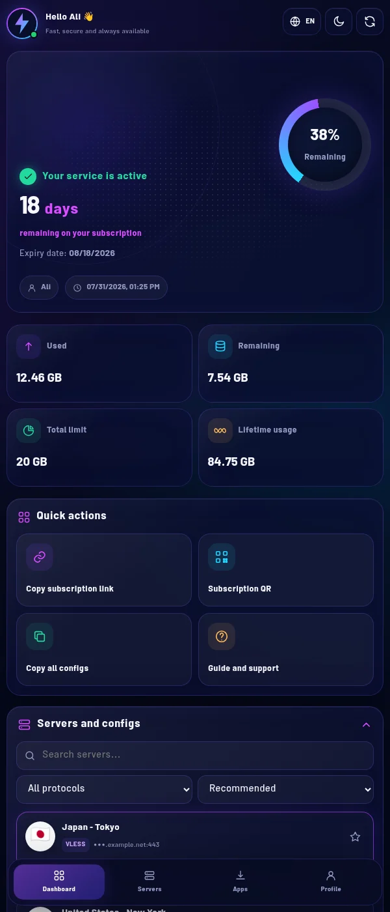

<p align="center">
  <strong>🇮🇷 فارسی</strong> ·
  <a href="README.en.md">🇬🇧 English</a> ·
  <a href="README.ru.md">🇷🇺 Русский</a> ·
  <a href="README.zh.md">🇨🇳 中文</a>
</p>

# قالب نئونی PasarGuard

## نصب سریع از GitHub

```bash
curl -fsSL https://raw.githubusercontent.com/7Berlin/pasarguard-neon-template/main/install.sh | sudo bash -s -- --activate
```

این دستور قالب را با **زبان فارسی** نصب و فعال می‌کند.



## دستورات نصب

| دستور | توضیح |
|---|---|
| `sudo bash install.sh --activate` | نصب با زبان پیش‌فرض فارسی |
| `sudo bash install.sh --activate -fa -en` | نصب فارسی و انگلیسی؛ فارسی پیش‌فرض |
| `sudo bash install.sh --activate -en -ru --default-lang en` | نصب انگلیسی و روسی؛ انگلیسی پیش‌فرض |
| `sudo bash install.sh --activate -fa -en -ru -zh` | نصب همه زبان‌ها |
| `sudo bash install.sh --activate --config ./template.conf` | نصب با فایل تنظیمات سفارشی |

| پرچم | زبان |
|---|---|
| `-fa` | 🇮🇷 فارسی |
| `-en` | 🇬🇧 انگلیسی |
| `-ru` | 🇷🇺 روسی |
| `-zh` | 🇨🇳 چینی |

## تنظیم قالب

فایل `template.conf` را ویرایش و دوباره نصب را اجرا کنید:

```bash
git clone https://github.com/7Berlin/pasarguard-neon-template.git
cd pasarguard-neon-template
nano template.conf
sudo bash install.sh --activate --config ./template.conf
```

| گزینه | کاربرد |
|---|---|
| `BRAND_NAME` | نام سرویس |
| `BRAND_SUBTITLE` | متن زیر نام کاربر |
| `AVATAR_URL` | آدرس اینترنتی تصویر پروفایل یا لوگو |
| `AVATAR_FILE` | مسیر فایل محلی PNG، JPG، WEBP، GIF یا SVG |
| `PRIMARY_COLOR` | رنگ اصلی |
| `SECONDARY_COLOR` | رنگ دوم |
| `CYAN_COLOR` | رنگ مکمل |
| `DEFAULT_THEME` | پوسته `dark` یا `light` |
| `SUPPORT_URL` | لینک آموزش یا پشتیبانی |
| `PANEL_DOMAIN` | دامنه پنل در صورت نیاز |

برای حمایت از پروژه، به آن در GitHub ستاره بدهید ⭐
